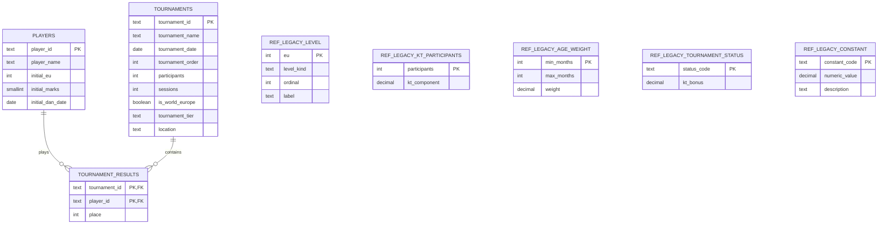

# Планируемая схема БД / API

## Что изменяемое, а что нет

`players`, `tournaments`, `tournament_results` — фактические данные.

`ref_legacy_*` — нормативные справочники Legacy. Они не должны редактироваться
через UI/API. В `db/schema.sql` UPDATE/DELETE для них запрещены триггерами.
Изменение нормативного справочника означает выпуск новой версии формулы,
а не изменение пользовательского пресета.

Экспериментальные коэффициенты лаборатории не перезаписывают эти таблицы.
